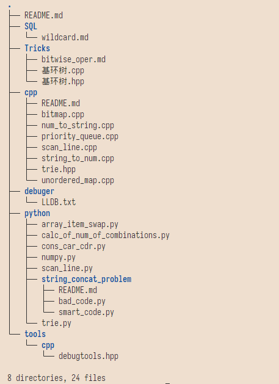

# About This Repo

这个仓库的目的是存储本人在学习过程中学到的或者自己写出的代码, 这些代码的价值是帮助日后回顾知识点, 以免总是在网上乱翻.

我希望这个仓库能够在我日后忘记某些API时为我提供帮助, 也就是起到个人代码片的存储作用.

目录一览：

（更新于 2022-09-22）



```txt
.
├── README.md
├── SQL
│   └── wildcard.md
├── Tricks
│   ├── bitwise_oper.md
│   ├── 基环树.cpp
│   └── 基环树.hpp
├── cpp
│   ├── README.md
│   ├── bitmap.cpp
│   ├── num_to_string.cpp
│   ├── priority_queue.cpp
│   ├── scan_line.cpp
│   ├── string_to_num.cpp
│   ├── trie.hpp
│   └── unordered_map.cpp
├── debuger
│   └── LLDB.txt
├── python
│   ├── array_item_swap.py
│   ├── calc_of_num_of_combinations.py
│   ├── cons_car_cdr.py
│   ├── numpy.py
│   ├── scan_line.py
│   ├── string_concat_problem
│   │   ├── README.md
│   │   ├── bad_code.py
│   │   └── smart_code.py
│   └── trie.py
└── tools
    └── cpp
        └── debugtools.hpp
```
